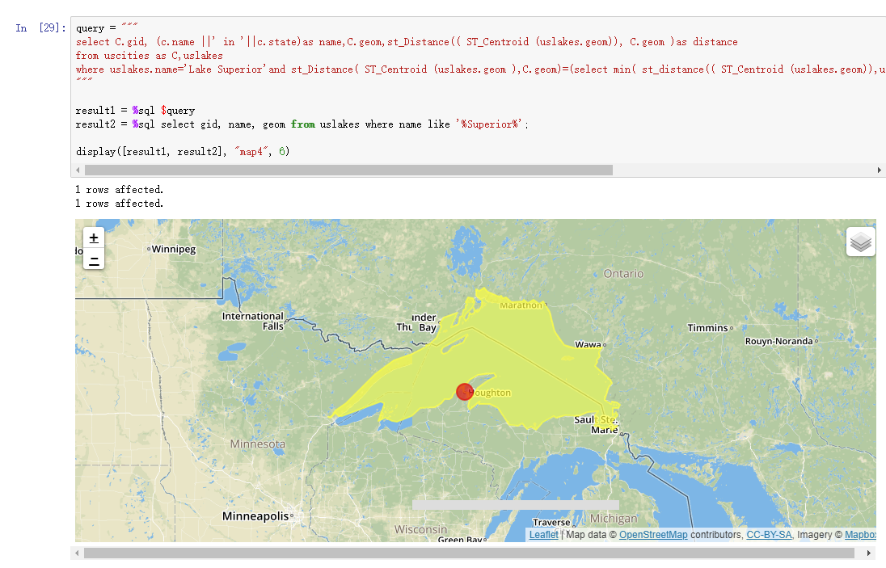
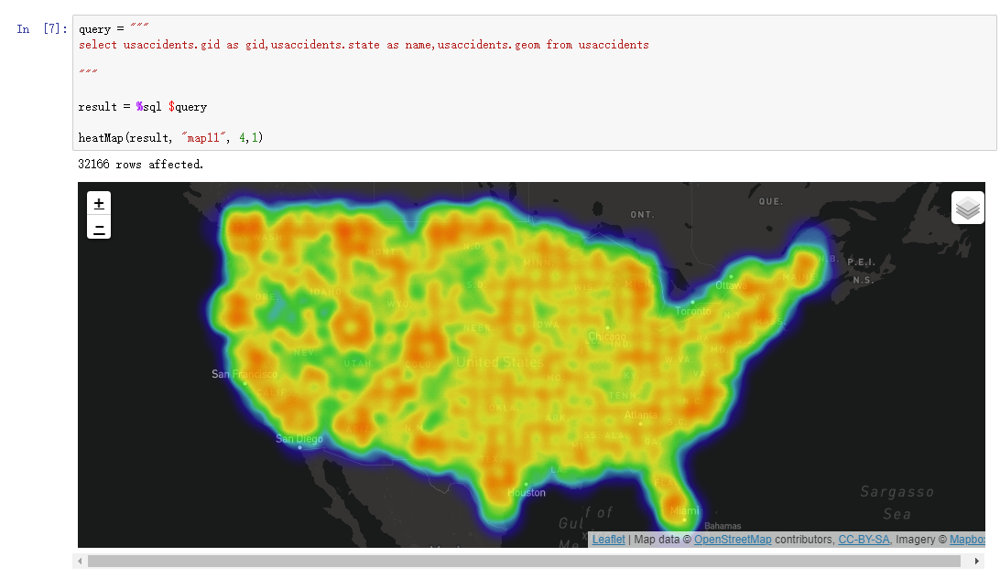

## Jupyter-postgis-visHelper
This is a tool whose goal is to visualize postgis geometry in jupyter notebook.

## Demo



## Prerequisite
1. a postgis database which store geom data
2. jupyter-notebook
3. connect to your database in jupyter notebook

## Usage
Download the whole project,put a jupyter file in the `jupyter-postgis-vis` direcotry.And then you can have fun in the jupyter file you've created.
Currently,the following two drawing functions are provided
```
display([result1, result2, ...], divId, zoom)对数组中所有的result数据进行几何展示，
result的关系类型至少包含(gid，geom，name)，zoom为放缩比例, name是在地图上描述geom的名词

heatMap(result, divId, zoom)对数组中所有的result数据进行热力图展示，
result的关系类型至少包括(gid，geom，name)，zoom为放缩比例，name是在地图上描述geom的名词, 也可以给出value值，用于颜色映射，缺省都为1
```

## How does it work?
After you execute a sql query and call the drawing functions,a direcotry named `jsonData` will be created in the `jupyter-postgis-vis` directory.The json file in `jsonData` directory will then be used to draw geometry by `leaflet.js`
